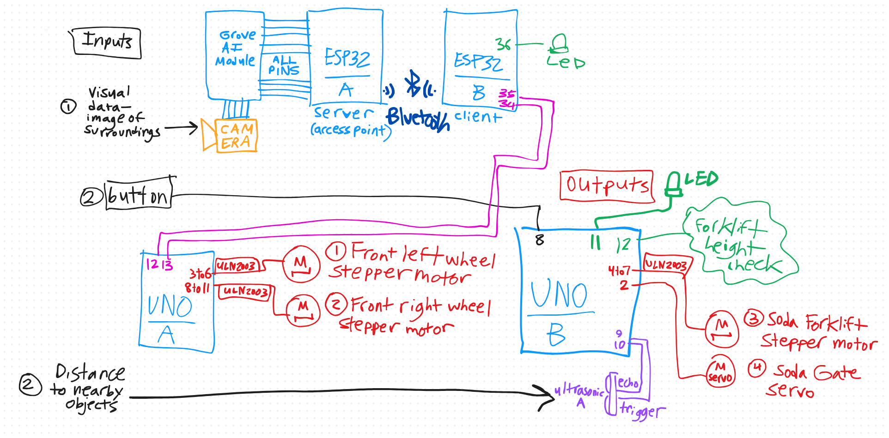
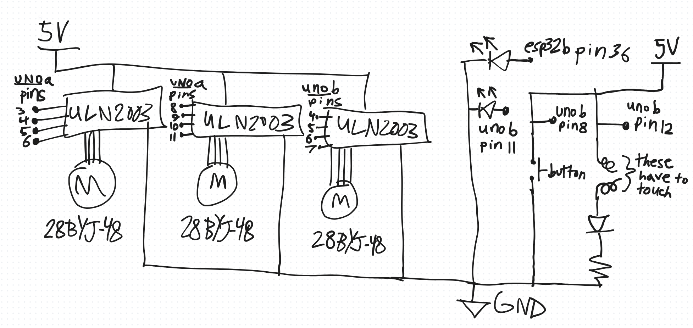
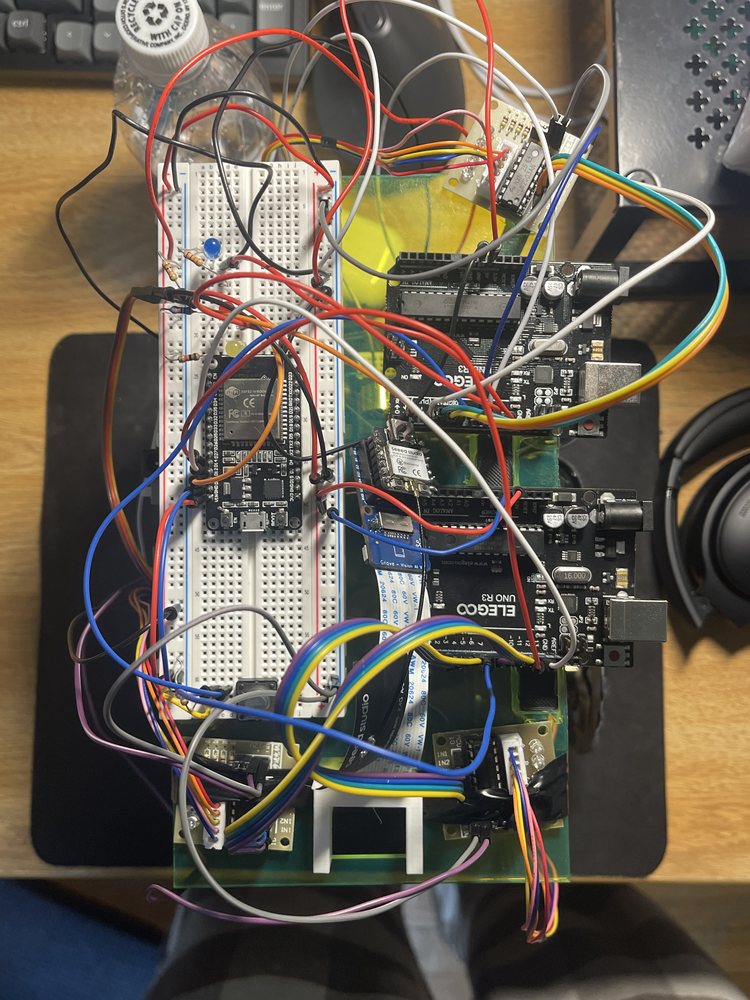
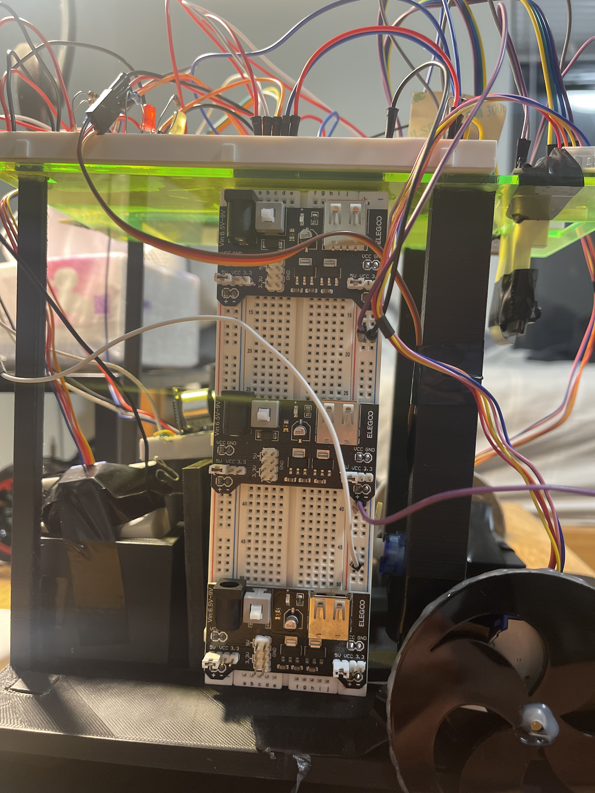
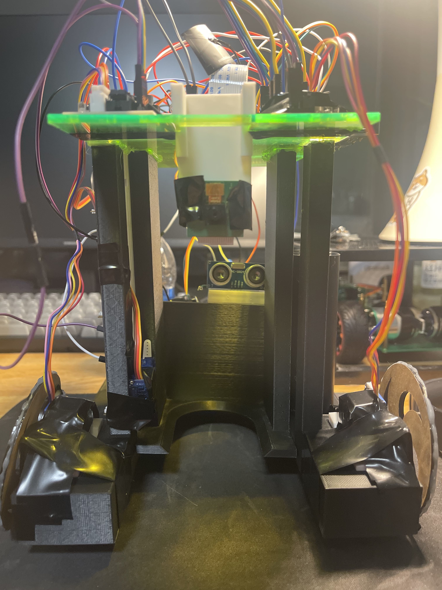
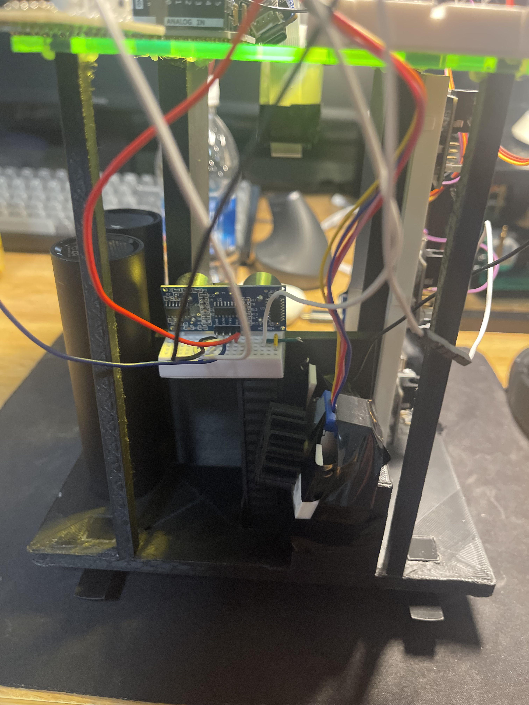
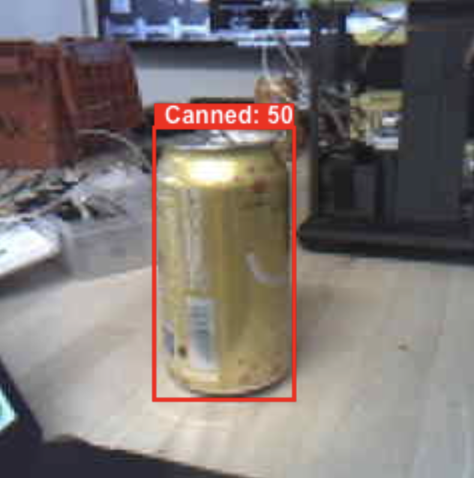

# Clank
Team Member(s): Phi Nguyen, Josiah Main

- Write up a paragraph or two that describes your final hack's objective, and all its sensors and actuators.

TODO: Clank is designed to autonomously detect soda cans using a camera and computer vision model, navigate toward the detected can using two stepper-motor–driven wheels, and then “collect” it using a forklift mechanism controlled by an ultrasonic-sensor trigger, a stepper motor for lifting, and a servo for locking the can in place.

# Schematics and Block Diagrams

Here is the block diagram.

Here is the schematic.

# Materials

| Item         | Source (URL) |
| ------------ | ------------ |
| Grove AI Vision v2  | https://wiki.seeedstudio.com/grove_vision_ai_v2/ |
| ESP32 WROOM | https://www.alibaba.com/pla/ESP32-WiFi-BLE-ESP32-WROOM-32U-IOT-Development_1601041257369.html?mark=google_shopping&biz=pla&searchText=electronic+modules+and+kits&product_id=1601041257369&GGS=y&pcy=us_en&field=ggs&src=sem_ggl&ggsnew=y&from=sem_ggl&traffic_type=directWake&campaign_id=22331632526&cmpgn=22331632526&adgrp=181424672779&fditm=&ggs=y&tgt=pla-2426183528333&locintrst=&locphyscl=9005925&mtchtyp=&ntwrk=g&device=c&dvcmdl=&creative=759262658295&plcmnt=&plcmntcat=&p1=&p2=&aceid=&position=&localKeyword=&gad_source=1&gad_campaignid=22331632526&gbraid=0AAAAAD8m77reJEdsNMce4hXqHsWs5Vdl6&gclid=Cj0KCQiAubrJBhCbARIsAHIdxD9DZDC80BsdcNa6R9Q9_jrfxmhuVesp7nNqIf24oR8TmJkbv1xbQUEaAvwuEALw_wcB |
| 3x Stepper Motor | https://www.aliexpress.us/item/3256806043512709.html?src=google&pdp_npi=4%40dis%21USD%216.06%212.05%21%21%21%21%21%40%2112000036381064661%21ppc%21%21%21&snps=y&snpsid=1&src=google&albch=shopping&acnt=752-015-9270&isdl=y&slnk=&plac=&mtctp=&albbt=Google_7_shopping&aff_platform=google&aff_short_key=_oDeeeiG&gclsrc=aw.ds&albagn=888888&ds_e_adid=775468814864&ds_e_matchtype=search&ds_e_device=c&ds_e_network=g&ds_e_product_group_id=2451479222870&ds_e_product_id=en3256806043512709&ds_e_product_merchant_id=5551326180&ds_e_product_country=US&ds_e_product_language=en&ds_e_product_channel=online&ds_e_product_store_id=&ds_url_v=2&albcp=23047568129&albag=186028244379&isSmbAutoCall=false&needSmbHouyi=false&gad_source=1&gad_campaignid=23047568129&gbraid=0AAAAA_eFwRAxR73PjswyzlinQP6AncAKw&gclid=Cj0KCQiAubrJBhCbARIsAHIdxD_X1QI4djHL9areVIGqn-ZULeS7ABiiodAl5Vz_5faIRUm8GQowbrkaArQMEALw_wcB&gatewayAdapt=glo2usa |
| Servo | https://www.aliexpress.us/item/3256807034882140.html?src=google&pdp_npi=4%40dis%21USD%215.35%212.70%21%21%21%21%21%40%2112000045887035357%21ppc%21%21%21&snps=y&snpsid=1&src=google&albch=shopping&acnt=752-015-9270&isdl=y&slnk=&plac=&mtctp=&albbt=Google_7_shopping&aff_platform=google&aff_short_key=_oDeeeiG&gclsrc=aw.ds&albagn=888888&ds_e_adid=775468814864&ds_e_matchtype=search&ds_e_device=c&ds_e_network=g&ds_e_product_group_id=2451479049350&ds_e_product_id=en3256807034882140&ds_e_product_merchant_id=5551326180&ds_e_product_country=US&ds_e_product_language=en&ds_e_product_channel=online&ds_e_product_store_id=&ds_url_v=2&albcp=23047568129&albag=186028244379&isSmbAutoCall=false&needSmbHouyi=false&gad_source=1&gad_campaignid=23047568129&gbraid=0AAAAA_eFwRAxR73PjswyzlinQP6AncAKw&gclid=Cj0KCQiAubrJBhCbARIsAHIdxD-w1xKgqPpiZiCohg9dv7NzlMQLcuoY8Wm9eohxYPuxy30UkykEQJwaAq09EALw_wcB&gatewayAdapt=glo2usa |
| Ultrasonic Sensor | https://www.alibaba.com/pla/HC-SR04-Ultrasonic-Distance-Measurement-Module-HC-SR04SR04PSR04Ultrasonic_1601247237258.html?mark=google_shopping&biz=pla&searchText=ultrasonic+sensors&product_id=1601247237258&pcy=us_en&src=sem_ggl&field=UG&from=sem_ggl&cmpgn=23120676610&adgrp=184003561822&fditm=&tgt=pla-301071594848&locintrst=&locphyscl=9005925&mtchtyp=&ntwrk=g&device=c&dvcmdl=&creative=778469393466&plcmnt=&plcmntcat=&aceid=&position=&gad_source=1&gad_campaignid=23120676610&gbraid=0AAAAAD8m77rVGZRqq9RvHrji4Gd9d1Ien&gclid=Cj0KCQiAubrJBhCbARIsAHIdxD_2612_i1w2nFMkxhn-e8iDJGcnTeX8awFi_q4nwZXOmDRwHtqE0hYaAukFEALw_wcB |

Additionally, please upload any design files for laser-cut or 3D-printed pieces to the parts directory.

# Narrative

- Describe the process of building your final hack project.
- Did the design change as you worked on it?
- Include any problems you encountered, and how you addressed them. 
- This section should be at least ~500 words. Be reflective!

There were two separate but major goals for Clank. The first was getting the computer vision working, and the second was designing the chassis.

### Computer Vision

On the computer vision side, there was an issue getting the Grove module to work through the Seeed Studio website. Seeed Studio provides a UI that lets you upload computer vision models to their Grove AI modules very easily. I had followed the documentation correctly. I soldered the pins to the ESP32, connected the ESP32 to the Grove AI module, connected the Arduino camera with the blue strip facing up (as shown in the documentation), plugged the Grove AI module into my laptop via USB-C, and followed the instructions for uploading a model. However, after the model uploaded, the module would reset every time I tried to invoke the preview.

After what felt like hundreds of resets and boots, I started to think the module was just broken. I searched online—“Grove AI invoke not working”—and scrolled through different forums. People mentioned specific OS requirements, browser versions, etc. It wasn’t until I stumbled upon a very specific message telling someone to try flipping the camera: instead of the blue strip facing up, flip it so the blue strip faces down. I was hesitant because the documentation explicitly shows it facing up, but I didn’t have any other solutions, so I tried it. And—what do you know—it worked. I was pretty mad at the documentation. They need to fix that.

Anyway, with the Grove AI module finally able to invoke the preview, I could test different computer vision models, and we found one that fit our soda-can-identifying needs. After reading the documentation for getting the Grove module working through the Arduino IDE and implementing the code, I was able to get inference results printing in the Serial Monitor. That meant that when the model detected a soda can, its X-coordinate would be printed. This was a huge win.

The second step was turning predictions into movement. Since all the pins on the ESP32 were being used by the Grove AI module, we needed a second ESP32—with free pins—to communicate with the ESP32 on the Grove module. This was our first time setting up wireless communication between two ESP32s, so it came with a lot of challenges. The ESP32 on the Grove AI module is called the XIAO, and it does not follow the standard Bluetooth protocol used in traditional ESP32s, so we had to follow the Seeed Studio documentation for it. I was already suspicious of the documentation, but some forums had sample code, so we started with that.

The next big problem was that after we got the ESP32s talking wirelessly, it only worked when both were connected to my laptop. The moment I detached one and powered it with its own battery, it stopped working. After two days of debugging, nothing worked. I read online that a 9V battery might not provide consistent power, but I didn’t think it was a big deal because I thought the output was capped at 5V anyways. After taking the ESP32s to class and getting the TAs to help—with no success—then Tom came, looked at it for 2.6 seconds, and suggested that the battery might be low. I took out my multimeter, measured the voltage across the terminals, and found that my 9V battery was actually sitting at 6V.

After switching the battery out, the ESP32s worked completely wirelessly and independent of my laptop. The second ESP32—with free pins—was able to light up an LED when the XIAO detected a soda can.

### Robot Structure

Making the robot frame and parts was a challenge in itself. This was our first non-trivial 3D modeling and 3D printing experience. We had to learn a lot about Onshape CAD software, for example how to make construction geometries and how to assemble and mate parts to simulate how the parts would fit together. Then we also had to learn a lot about 3D slicing and printing software. Here is a summary of my challenges.

For a few days we were making the model of the wheels. We found the measurements of the 28BYJ-4 5-volt stepper motor and added a slot/hole the correct size to stick the wheel directly onto the rotating part of the motor. We didn't end up using this model - more on this later. We had to make it cleverly so that it could be printed from the bottom up with no support material. This was a challenge for designing all the models because when we think about a 3D object we usually don't have such restrictions in mind, so we might make a bridge or ceiling over something. Of course, this would be impossible to print. This went on to become a recurring theme in the modeling process.

Then we made the forklift part which would hold the soda can. We found the measurements of a standard 355mL soda can online and made a forklift with a circular rim of the same size. We added a chamfer to slope it down to the floor allowing the can to slip in smoothly. However we also needed to have a rack on the back of it so that it could be moved up and down by a pinion gear. This would be impossible to print in one piece with the forklift itself, so we cut a slot into the model and built the pinion separately so it could slide in.

Building the rack itself was also a challenge. We used an Onshape script to generate the pinion gear, and then cut a hole in it according to the measurement of the 28BYJ-4 stepper motor. The hard part was when we had to contruct the pinion ourselves with the proper angles. This was difficult due to our limited Onshape knowledge. In particular we had to learn how to make construction lines, and we weren't sure how to generate lines with a certain angle fixed between them. But the rack and pinion ended up meshing satisfactorily, which was a huge win!
We used this video to learn how to make the rack: https://www.youtube.com/watch?v=wLZq1ZXhPfE

Then we wanted to test the rack and pinion so we had to make a mate relation allowing them to move with one another. This was a steep learning curve because w didn't even know what a mate relation was. After about a day of work, we connected the rack and pinion in simulation, and the forklift was looking like it would move nicely.

We continued modeling more parts, including a chassis. The chassis had a wide rail to support the forklift while it slid up and down. We opted for having skids on the back rather than four wheels - which may have been suboptimal because dragging on the ground led to a lot of friction. We realized in the chassis we had another item we couldn't simply print from the bottom up - a place for the stepper motor to connect. We modeled a stepper motor holder piece and made three copies of it. We modeled a ceiling and a piece to slot into it which would hold the camera with four pins. Finally the models were finished and it was time to print!

We went to TechSpark to print and found that the models were too large to be contained in the Ender Creality 3 printers we were using. We redesigned many parts to slightly trim down the size. We attempted to print the parts on two printers, but on the first attempt both prints failed. We worked with TechSpark staff to identify that this was a leveling issue with the build plate. We leveled the printers properly and printed them over the weekend leading up to the final showcase. One print failed due to extruding problems, but we got the chassis, a stepper holder, skids, forklift, rack, pinion, and many other items. This was great! Some of them had tolerances a bit off and needed to be sanded down and filed to fit, particularly the skids and the forklift.

We realized the roof would take too many hours to print, but it was essentially a flat rectangular prism with holes in it. This made it easy to laser cut. We converted one of our Onshape 3D models to a .dxf file and ran it through the Epilog laser cutter. It cut perfectly on the first try and fit right on top of the chassis. We hot glued the roof to the chassis so it wouldn't slide around.

We finally got them all fitting properly, while we worked on printing the other parts that had failed to print. From this we got some wheels, stepper holders, and a camera holder. Unfortunately none of these ended up being usable - the wheels had holes too large to fit on the pegs of the stepper motors; the stepper holders were too thick, not allowing clearance for the wheels to fit onto the pegs of the stepper motors; the camera holder didn't print properly and the pins on it snapped.

We printed new, thinner, stepper holders in white, which worked great. Along with them we printed a sturdier camera mount, including having a draft angle on the pins of the camera holder so they tapered. Being thicker at the base, the pins were less likely to snap off. Now we just needed the wheels.

Making the wheels ended up being one of the most stressful parts of the process. After two failed prints that didn't work because of sloppy CAD design, we realized it was wasting lots of time and lots of filament to 3D print each time. We tried to cut wheels out of acrylic. On our first try the holes in the wheels were misaligned because we cut the wheel out of the acrylic sheet before cutting the hole into it, so the wheel fell down and moved during cutting. On my second try, the holes were aligned alright, but sadly the holes were a little too loose, making them wiggle on the stepper motors. Worse, they were slick acrylic and couldn't get enough traction to roll the robot forward. Wanting to move on to assembling the robot and coding, we opted to just add some hot glue around the wheel rims and axle holes to make the holes smaller and add traction to the rims.

In order to put the parts together we used black electrical tape. Some of the parts moved around slightly when the tape was not tight enough, but it got the job done. Finally the robot frame was completely built, just in time to put the electronics on and write the code for the final showcase!

### Motor and Power Issues

When we had added the stepper motors, we had a lot of issues powering them. The first issue was that we powered them from the Arduino Uno boards. This is not allowed because the motor driver draws far too much current to feasibly come from the Uno. So then we tried to shift to another battery supply. Eventually we connected 3 9V batteries with 5V voltage regulators in parallel on a breadboard. This allowed us to supply 3 times the current at the same voltage. Even then, the motors were not getting a lot of current, making them very, very slow. This was an issue we faced even going into the final showcase. There was also the possibility that we might have damaged certain of the components like the Uno board by attempting to run them at higher speed and lower power than was reasonable. We found that the Uno could still be used for sending and receiving high and low voltage signals, but swapped it out for a spare Uno just in case.

### Changes to Design

We removed and added some components. We decided not to use the infrared remote control to start and stop the robot, instead opting for a simple button. This was mostly due to time constraints.

We had to change the number of boards we were using to have enough pins, in particular adding another Arduino Uno board.

# System Photos

- Include photos that describe your system in the img directory.
- Include a descriptive caption for each image.

Top view where you can see the motor controllers, breadboard, Grove module, ESP32 boards, and Arduino Uno boards

Side view where you can see the breadboard with battery 5V regulators, ultrasonic distance sensor, stripped wire for calibrating forklift, and wheels.

Side view where you can see the ultrasonic distance sensor, forklift, and Raspberry Pi Camera.

Rear view where you can see the battery packs, rack and pinion, and stepper for the forklift. Right now it is a little crooked.

Grove AI module identifying a bounding box for a soda can.

# Code Description

- See the code folder.
